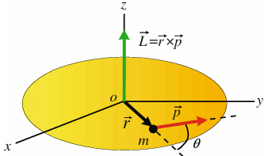
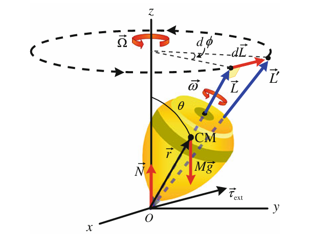
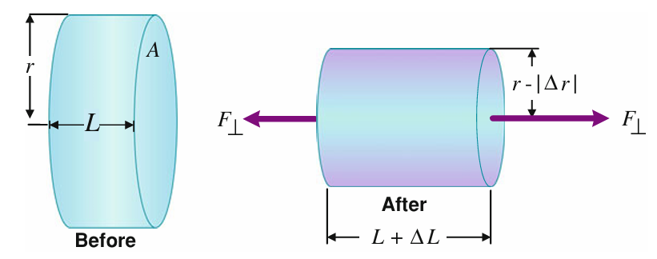
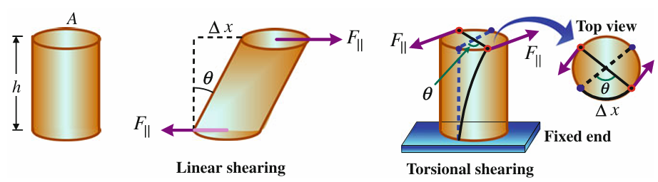
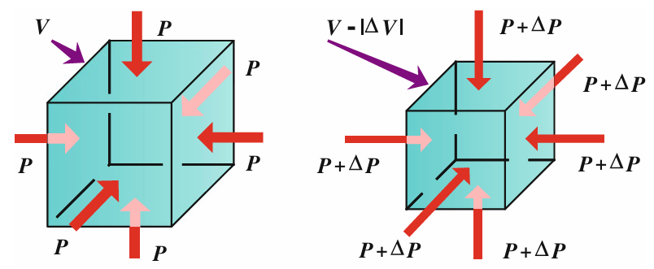

# Part 1

## 1. Dimensions and Units

### 1.1 The International System of Units（国际单位制）
a.物理中的常用单位，如时间(s)、长度(m)、质量等(kg)
b.单位的前缀，如$peta-$ : $10^{15}$、$tera-$ : $10^{12}$、$pico-$ : $10^{-12}$、 $nan0-$ : $10^{-9}$

### 1.2 StandardsofLength,Time,andMass（长度、时间和质量的标准）
a.长度：1 c = 299792458 米/秒 $\Rightarrow$ 光年：光行驶一年的长度单位
b.时间：1 s = 一个铯原子进行 9,192,631,770 次振荡以发射特定波长辐射所需的时间
c. 质量：(1)1 kg = 保存在法国计量局的铂铱合金圆柱体的质量
(2)1 u = $(1.660 540 2±0.000 001 0) × 10^{−27} kg$

### 1.3 DimensionalAnalysis（维度分析）
a.一维：L  $\;$  二维：L$^{2}$  $\;$  三维: L$^{3}$
b.
$$
{L \over T} = {L \over T} + {L \over T^{2}} × T = {L \over T} + {L \over T} 
$$
因此表达式 $v = v_{0} + at$ 在维度上正确
c.通过表达式中元素的单位可以推出结果的单位
$\color{red}{通过结果的单位可以推出固定表达式中元素的幂}$

## 2 Vector（向量）

### 2.1 Vectors andScalars（向量和标量）
a.向量：大小、方向（速度，加速度，位移等）
b.标量：大小（路程等）

### 2.2 Properties of Vectors（向量的属性）
a.向量相等：大小、方向相等
b.向量相加：平行四边形相加法则，加法交换律，加法结合率
c.向量的负数：大小相等、方向相反

### 2.3 矢量分量和单位响亮
a.矢量分量：将一个二维向量分为和x、y轴两部分
$$
A^{2} = A^{2}_{x} + A^{2}_{y}  {\quad}和{\quad}  \color{red}θ = tan^{-1}({A_{y} \over A_{x}})
$$
b.单位向量：长度为1的向量
$$
\overrightarrow{A} = A_{x}\overrightarrow{i} + A_{y}\overrightarrow{j}
$$

### 2.4 MultiplyingVectors（乘法向量）
a.向量乘标量：相当于把向量取反，增大或缩小
b.标量积：
$$
\overrightarrow{A} \cdot \overrightarrow{B} = ABcosθ
$$
c.向量积：
$$
\overrightarrow{C} = \overrightarrow{A} \times \overrightarrow{B} = ABsinθ (向量A、B分别与C垂直)
$$
平行相乘为0，服从分配率

### 2.5 Section 2.2 Properties ofVectors（第2.2节向量的属性）
a.主要讲解了二维和三维向量的分解与合并

# Part 2

## 3 Motion in One Dimension（一维运动）

### 3.1 Position and Displacemen（位置和位移）
需要参照物（坐标轴等）
a.位置：标量
b.位移：向量

### 3.2 Average Velocity and Average Speed（平均速度和平均速率）
a.平均速度（矢量）：位移 / 时间
b.平均速率（标量）：路程 / 时间

### 3.3 Instantaneous Velocity and Speed（瞬时速度和速率）
a.瞬时速度（矢量）：位移变化 / 时间间隔
    位置-时间图的斜率，正负取决于斜率
b.速率：定义为其速度大小

### 3.4 Acceleration（加速度）
a.平均加速度（矢量）：速度变化 / 时间间隔
b.瞬时加速度（矢量）：当t接近0时 v / t 的极限值
$$
\color{red}a = {dv \over dt} = {d^{2}x \over dt^{2}} = v_{f} - v_{i} = \int_{t_{i}}^{t_{f}}adt
$$

### 3.5 Constant Acceleration（恒定加速度）
常见的一维运动：平均加速度 = 瞬时加速度
此时：
$$
v = v_{0} + at
\qquad
x - x_{0} = v_{0}t + {1 \over 2}(v_{0} + v)t = v_{0}t + {1 \over 2}at^{2}
\qquad
v^{2} = v_{0}^{2} + 2a(x - x_{0})
$$

### 3.6 Free Fall（自由落体）
地球表面附近的物体且空气阻力影响非常小时 $\Rightarrow$ 自由落体运动
此时g = 9.8 $m/s^{2}$

## 4 Motion in Two Dimension（二维运动）

### 4.1  Position,Displacement,Velocity,and AccelerationVectors（位置，位移，速度和加速度矢量）
a.置换向量：位移向量 = 最终位置向量 - 初始位置向量
b.平均速度：v的维度是长度除以时间，是一个向量，大小和方向沿位移矢量
c.瞬时速度：位移变化 / 时间间隔
d.平均加速度：速度变化 / 时间间隔
e.瞬时加速度：当t接近0时 v / t 的极限值
（将数值换成向量，且：
$$
\color{red}\overrightarrow{a} = a_{x}\overrightarrow{i} + a_{y}\overrightarrow{j}
$$

### 4.2  Projectile Motion（弹射物运动）
重力引起的加速度恒定、空气阻力不计：
1.水平和垂直运动独立
2.弹丸轨迹总是抛物线
a.抛体的水平运动
$$
x = v_{xo}t = (v_ocosθ_o)t
$$
b.弹射物的垂直运动
$$
y = v_{yo}t - {1 \over 2}gt^2 = (v_osinθ_o)t - {1 \over 2}gt^2\\ 
v_y^2 = v_{yo}^2 - 2gy = (v_osinθ_o)^2 - 2gy
$$
c.水平射程投射物
$$
T = {2v_osinθ_o \over g}\\
R = {v_o^2sin2θ_o \over g}, 0 \leq θ_o \leq π/2
$$
d.发射物的最大高度
$$
H = {v_o^2sin^2θ_o \over g}, 0 \leq θ_o \leq π/2
$$
e.轨迹方程式
$$
y = {-g \over 2v_o^2sin^2θ_o}x^2 + (tanθ_o)x, 0 \leq θ_o \leq π/2
$$

### 4.3 UniformCircular Motion（均匀圆周运动）
$$
a_r = {v^2 \over r} （向心加速度）\\
T = {2πr \over v} （周期）
$$

### 4.4 Tangential andRadialAcceleration（切向加速度和径向加速度）
粒子速度的方向和大小都发生变化时可解析为两个分量向量：$\color{red}切向分量向量$ 和 $\color{red}径向分量向量$
$$
\overrightarrow{a} = \overrightarrow{a_t} + \overrightarrow{a_r}
$$

### 4.5  Non-uniformCircular Motion（非均匀圆周运动）
$$
\overrightarrow{a} = \overrightarrow{a_t} + \overrightarrow{a_r} = {dv \over dt}\overrightarrow{θ} - {v^2 \over r}\overrightarrow{r}
$$

## 5 Force and Motion（力和运动）

### 5.1 The Cause of Acceleration and Newton’s Laws（加速度的成因和牛顿定律）
a.牛顿第一定律：物体将保持静止或匀速运动，除非它受到净外力
b.牛顿第二定律：
$$
\sum\overrightarrow F = m \overrightarrow a
$$
c.牛顿第三定律：对于每一个动作，都必须有一个大小相等、方向相反的反应

### 5.2 SomeParticularForces（某些特定力量）
a.法向力：法向力是防止块从表中掉下来的力，在打破表之前可以具有任何值
$$
N = W = mg
$$
b.摩擦焦点：
$$
f_s \leq  μ_s N
$$
c.张力的焦点（T）：
绳索中的张力定义为绳索施加在身体上的力(摩擦不计)
d.阻力对象（$F_D$）
空气阻力：
$$
\color{red}F_D = {1 \over 2}CρAv^2
$$
$$
v_t = \sqrt{2mg \over CρA}
$$

## 6 Work, Energy, and Power（工作、能源和电力）

### 6.1 Work Done by a Constant Force（恒力所做的功）
定义为位移方向上的力分量与位移大小的乘积
a.重力做的功：
$$
W_F = mgs \qquad W_g = mgs
$$
b.摩擦力做的功：
$$
W_F = \overrightarrow{F} \overrightarrow{s} = Fscosθ
$$

### 6.2 Work Done by a Variable Force（由可变力完成的工作）
a.一维分析：
$$
W \simeq \sum_{x_i}^{x_f}F(x) \Delta x = \int_{x_i}^{x_f}F(x)dx
$$
b.弹力做的功：
$$
F = -k_Hx(胡克定律)
$$
$$
W_s = \int_{x_i}^{x_f}F(x)dx = \int_{x_i}^{x_f}(-k_Hx)dx = {1 \over 2}k_Hx_f^2 - {1 \over 2} k_Hx_i^2
$$
c.三维分析：
$\overrightarrow{F} = F_x \overrightarrow{i} + F_y \overrightarrow{j} + F_z \overrightarrow{k}$
$$
W = \int_{r_i}^{r_f}dW = \int_{x_i}^{x_f}F_xdx + \int_{y_i}^{y_f}F_ydy + \int_{z_i}^{z_f}F_zdz
$$

### 6.3 Work-EnergyTheorem（功-能量定理）
$$
K = {1 \over 2}mv^2\\
W = \Delta K = K_f - K_i
$$

### 6.4 Conservative Forces andPotential Energy（保守力和势能）
a.保守力和非保守力
（1）保守力：功只与运动物体的起点和终点的位置有关（重力等）
（2）非保守力：不仅与运动物体起点和终点的位置以及力场的性质有关，而且还与物体运动所经过的路径有关（摩擦力等）
b.势能
$$
W_c = - \Delta U = U_i - U_f = - \int_{i}^fF_xdx \:\: or \:\: F_x = - {dU \over dx}
$$
c.引力势能
$$
\Delta U = U_i - U_f = mg(y_f - y_i) = mg \Delta y
$$
d.弹性势能
$$
\Delta U = U_i - U_f = {1 \over 2} k_Hx_f^2 - {1 \over 2} k_Hx_i^2
$$

### 6.5 Conservation of Mechanical Energy（机械能量守恒）
a.当只有一个保守的力作用系统时，动能和势能才能发生变化。然而，他们的和，系统的机械能量E，并没有改变：
$E_i = E_f$
b.如果多于一个保守的力作用于系统，其中每个系统都与势能相提并论，那么机械能的守恒就会采取这种形式:
$$
K_i = \sum U_i = K_f = \sum U_f
$$

### 6.6 WorkDonebyNon-conservativeForces（非保守力所做的功）
a.所有非守恒力 W（或 $W_{nc}$）所做的功等于系统总机械能的变化:
$$
W_{nc} = \Delta E = E_f - E_i
$$

### 6.7 Conservation of Energy（能量守恒）
扩展系统后摩擦力转换成的热量也会在扩展的系统内传递，达到能量守恒：
$$
\Delta E_tot = \Delta K + \Delta U + \Delta E_int（独立系统的能量守恒）
$$

### 6.8 power（功率）
$ \overline{P} = {\Delta W \over \Delta t} $
$ p = \lim_{\Delta t \to 0} {\Delta W \over \Delta t} = {dW \over dt} $
$ p = \overrightarrow{F} \overrightarrow{v} = Fvcosθ $

## 7 Linear Momentum, Collisions, andCenterofMass（线性动量、碰撞和质心）

### 7.1  Linear Momentum and Impulse（线性动量和冲量）
a.线性动量（动量）是作用于粒子等于乘积 m→ V 每单位时间的变化：
$ \overrightarrow{P} = m \overrightarrow{v} $
b.冲量（动量变化量）：
$ \overrightarrow{J} =  \int_{t_i}^{t_f}\overrightarrow{F} dt = \overline{\overrightarrow{F}} \Delta t = \Delta \overrightarrow{P} $ $\quad$ and $\quad$ $\overline{\overrightarrow{F}} = {\overrightarrow{P} \over \Delta t} $

### 7.2 Conservation of Linear Momentum（线性动量守恒）
孤立的粒子系统的总线性动量保持不变

### 7.3  Conservation of Momentumand Energy in Collisions（动量守恒和碰撞中的能量）

#### 7.3.1 ElasticCollisions in One and Two Dimensions（一维和二维中的弹性碰撞）
在两个迎面碰撞的小物体的弹性碰撞中应用动量和动能守恒定律：
$$
v_1 - v_2 = - (v_1^{'} - v_2^{'})\\
v_1^{'} = {{m_1 - m_2} \over {m_1 + m_2}}v_1 + {{2m_2} \over {m_1 + m_2}}v_2\\
v_2^{'} = {{2m_1} \over {m_1 + m_2}}v_1 + {{m_2 - m_1} \over {m_1 + m_2}}v_2
$$

#### 7.3.2 Inelastic Collisions（非弹性碰撞）
a.部分初始动能被转移到其他类型的能量（如热能或势能），或部分内能（如化学或核能）以动能的形式释放
b.如果两个对象在碰撞后粘在一起，则碰撞称为完全非弹性碰撞,即使动能不守恒那些碰撞，总能量守恒

### 7.4 Center of Mass(CM)（质心）
$$
\overrightarrow{r_{CM}}（三维向量） = {\sum{m_i \overrightarrow{r_i}} \over M（总质量）} = {1 \over M} \int \overrightarrow{r} dm
$$

### 7.5  Dynamics of the Center of Mass（动态的质心）
a.系统上的净外力等于系统的总质量乘以其质心的加速度
b.对于总质量为 M 的粒子（或扩展物体）系统，质心点的存在就好像所有质量 M 都集中在该点上，并且所有外力都作用在同一个点上
c.粒子系统：总线性动量 = 总质量 * 质心的速度
d.扩展对象：线性动量 = 其总质量 * 其质心的速度

### 7.6 Systems of Variable Mass（变质量系统）

#### 7.6.1 Systems of Increasing Mass（增质量系统）
$$
\int \overrightarrow{F_{ext}} + (\overrightarrow{u} - \overrightarrow{v}){dM \over dt} = M{d \overrightarrow{v} \over dt}
$$

####  Systems of Decreasing Mass;Rocket Propulsion（火箭推进）
$$
\int \overrightarrow{F_{ext}} + \overrightarrow{v_{rel}}{dM \over dt} = M{d\overrightarrow{v} \over dt}
$$

## 8 Rotational Motion（旋转运动）

### 8.1 Radian Measures（弧度测量）
$1 rev= 360◦ = 2π rad ⇒ 180◦ =π rad$
$1◦ = (π/180)rad \simeq 0.02rad$
$1rad= 180◦/π \simeq 57.3◦.$

### 8.2  Rotational Kinematics;Angular Quantities（旋转运动学;角度量）
a.角度位置：以弧度表示的θ
b.角度位移：$\Delta θ = θ_2 - θ_1$
c.角速度：
$$
{ω = \lim_{\Delta t \rightarrow 0} {\Delta θ \over \Delta t} = {dθ \over dt}} 
\quad \equiv \quad
{θ_f - θ_i = \int_{t_i}^{t_f} ω dt}
$$
d.角度加速度：
$$
{α = \lim_{\Delta t \rightarrow 0}{\Delta ω \over \Delta t} = {dω \over dt}}
\quad \equiv \quad
{ω_f - ω_i = \int_{t_i}^{t_f} α dt}
$$

### 8.3 Constant AngularAcceleration（恒定角加速度）
与线性量的定义相似:θ、ω、α $\Rightarrow$ x、v、a

### 8.4 Angular Vectors（角度向量）
通过将旋转轴选为角速度矢量的方向，将角速度视为矢量

### 8.5 Relating Angular andLinearQuantities（有关角和线性量）
$ v = rω $
$ T = {2π \over ω}, f = {1 \over T} = {ω \over 2π} $
$ a_t = rα = rω^2 (α = dω/dt) $

### 8.6  Rotational Dynamics;Torque（旋转动力学）
扭矩：旋转的速率取决于所施加力的大小和方向，以及该力从旋转轴施加的距离
(顺时针为负数，逆时针正数)
$ \overrightarrow{τ} = \overrightarrow{r} \overrightarrow{f} = rFsinθ$

### 8.7 Newton’s Second Law for Rotation（牛顿的旋转第二定律）
扭矩：
$$
\sum τ = Iα = \sum m_ir_i^2 α（I为转动惯量）
$$
$$
\sum τ = Iα = α\int r^2dm
$$
平行轴定理：
$$
I = I_{CM} + Mh^2 = \int r^2dm \\
(h为与转轴距其在CM上平行轴的距离)
$$
Thin hoopor thin cylindrical shell(薄箍或薄圆柱壳):
$ I_{CM} = M R^2 $
Hollow cylinder(空心圆柱体):
$ I_{CM} = {1 \over 2}M(R_1^2 + R_2^2) $
Thin hoop(薄箍):
$ I_{CM} = {1 \over 2}MR^2 $
Solid cylinder(实心圆柱体):
$ I_{CM} = {1 \over 4}MR^2 + {1 \over 12}ML^2 $
Solid cylinder or disk(实心圆柱体或圆盘):
$ I_{CM} = {1 \over 2}MR^2 $
Rectangular plate(矩形板):
$ I_{CM} = {1 \over 12}M(a^2 + b^2) $
Thin rod(细杆):
绕中心旋转:$ I_{CM} = {1 \over 12}ML^2 $
绕头旋转:$ I_{CM} = {1 \over 3}ML^2 $
Solid sphere(实心球):
$ I_{CM} = {2 \over 5}MR^2 $
Thin spherical shell(薄球形壳):
$ I_{CM} = {2 \over 3}MR^2 $

补：$\color{red} 可通过 \sum τ = rF = Iα 计算未知量$

### 8.8  Kinetic Energy,Work,and Power in Rotation（动能、功和旋转中的动力）
a.旋转动能:类似于平移动能（$ {1 \over 2} mv^2 $）
$$
K_R = {1 \over 2} Iω^2
$$
b.旋转做的功：
($ dW = Fsinφ rdθ $)
$$
W = \int_{θ_i}^{θ_f} τdθ \quad or \quad W = \int_{ω_i}^{ω_f}Iωdω = {1 \over 2}Iω_f^2 - {1 \over 2}Iω_i^2 = \Delta K_R
$$
c.旋转的功率：
($rpm = {rev（转） \over min} $, $1rev = 2πrad = 360^。$)
($ 1HP（马力） = 0.746kW $)
$$
P = {dW \over dt} = τω
$$

### 8.9 Rolling Motion（滚动运动）
a.以旋转和平移组合滚动：
摆线：车轮在平滑地面不打滑地滚动且重心MC呈直线时圆周上点Q的运动路线
b.以纯旋转滚动：
$$
K_{Roll}(滚动动能) = {1 \over 2}I_Pω^2 = {1 \over 2}I_{CM}ω^2 + {1 \over 2}Mv_{CM}^2  
$$
c.摩擦滚动：
当车轮的线速度$ v_{CM} $或角速度 ω发生变化时，摩擦力倾向于在接触点 P 处滑动车轮：
(1).ω的增加或减少会使触点P向某方向滑动，而摩擦力会oppose这个趋势（如：顺时针增加的ω会使P有向左滑动的趋势，因此摩擦力向右以对抗它）
(2).$ v_{CM} $的增加或减少所引起的摩擦力与滑块相似

## 9 Angular Momentum（角动量）

### 9.1 Angular Momentum of Rotating Systems（旋转系统的角度动量）

#### 9.1.1 Angular Momentum of a Particle（粒子的角动量）
$$
\overrightarrow{L}(角动量) = \overrightarrow{r}(放置向量) \times \overrightarrow{p}(动量 = mv) = rpsinθ(θ是r和p的夹角) \\ 
\sum \overrightarrow{τ} = {d\overrightarrow{L} \over dt}(Single \ particle)
$$

#### 9.1.2 Angular Momentum of a System of Particles（粒子系统的角动量）
$$
\sum \overrightarrow{τ_{CM}} = {d\overrightarrow{L_{CM}} \over dt} (System \ of \ particles)(Even \ if \ CM \ is \ accelerating)
(基于牛顿第三定律，系统的内力互相抵消)
$$

#### 9.1.3 Angular Momentum of a Rotating Rigid Body（旋转刚体的角动量）
$$
L_Z = \sum r_ip_i = \sum \Delta m_ir_iv_i = \sum (\Delta m_ir_i^2)ω = Iω \\
\sum \overrightarrow{τ_{ext}} = {d\overrightarrow{L_Z} \over dt} = I \overrightarrow{α}
$$

### 9.2  Conservation of Angular Momentum（角动量守恒）
如果作用在系统上的净外部扭矩为零（即独立系统）则系统的总角动量在大小和方向上保持不变

### 9.3 The Spinning Top and Gyroscope（陀螺和陀螺仪）
陀螺旋转时其法向力位于旋转轴上，因此其r=0产生零扭矩。此时角动量沿r向量向外与重力产生力矩$ \overrightarrow{τ_{ext}} = \overrightarrow{r} \times M \overrightarrow{g} = rMgsinθ$垂直于r与mg的平面，而角动量随着力矩的方向变化积累（力矩与角动量相当于加速度与速度）

其中 $ dL = L sinθ dφ $ 
将这个表达式带入进动(precession)角速度$ \Omega = {dφ \over dt} = {τ_{ext} \over Lsinθ} = {Mgr \over L} $
$$
\Omega = {Mgr \over Iω} 
$$ (当$ \Omega << ω $时成立)
由$ \Omega = {2 \pi \over T_p} \quad ω = {2 \pi \over T_s} $ (${T_p}$ 为进动周期， ${T_s}$ 为自旋周期) 可得：
$$
T_p = {4 \pi^2 I \over MgrT_s}
$$

## 10 Mechanical Properties of Matter（物质的机械特性）
物体状态通常分为：固体(soild)、液体(liquid)、气体(gas)

### 10.1 Density and Relative Density （密度和相对密度）
如果质量m均匀地分散在体积V中，则：
$$
ρ = {m \over V}
$$
比重(SG)：物质的密度是纯水的多少倍
$$
SG = {ρ \over ρ_{water}}
$$

### 10.2 Elastic Properties of Solids（固体的弹性）
(1)stress（应力）：垂直作用在物体单位面积上的外力大小
(2)strain（应变）：在应力作用下的单位变形量
(3)Elastic modulus（弹性模量）：材料在受到负荷变形时产生的阻力的衡量
 = $ {Stress \over Strain} $
(4)Young’s Modulus（杨氏模量）：描述固体材料抵抗形变能力的物理量
(5)Shear Modulus（剪切/切变/刚性模量）：描述材料在剪切应力作用下抵抗剪切变形的能力
 = $ {τ(剪切应力) \over γ(剪切应变)} $
(6)Bulk Modulus（体积模量）：描述固体（或者液体）对变化起始量的阻力

#### 10.2.1 Young’s Modulus:Elasticity in Length（杨氏模量：长度弹性）
描述固体对其长度变化的抵抗力，这表示其刚度
当外力F⊥垂直于杆的横截面积 A 施加时，其内力会抵抗其变形。当杆的长度增加时时，杆达到平衡，垂直外力的大小 F⊥ 正好平衡了内力：
$$
Tensile stress(拉伸应力) = {F_⊥ \over A}(N/m^2)
\\
Tensile strain(拉伸应变) = {\Delta L \over L}
$$
$$
Y(杨氏模量) = {Tensile stress \over Tensile strain}
$$
杆在形变时长度增加半径减少，其中
$$
μ(泊松比) = {Lateral strain \over Linear strain} = -{\Delta r / r \over \Delta L / L} = -{L dr \over r dL}
$$

#### 10.2.2 Shear Modulus:Elasticity of Shape（剪切模量：形状的弹性）
一个圆柱形杆受线性或扭转剪切应力变形，这是由于平行于表面积A的力F引起的。当剪切力F的作用与内部剪切力完全平衡时，杆的形状将达到平衡：
$$
Shearing stress = {Tangential acting force \over Area of surface being sheared} = {F_{||} \over A}(N/m^2)
\\
Shearing strain = {Distance sheared \over Distance between surfaces} = {\Delta x \over h} = tanθ \approx θ(适用于微小应变)
$$
$$
S(剪切模量) = {Shearing stress \over Shearing strain} = {F_{||}/A \over \Delta x/h}(N/m^2)
$$

#### 10.2.3 Bulk Modulus:Volume Elasticity（体积模量：体积弹性）
压力 P 定义为垂直作用在物体的单位面积上的力：
$$
P = {F_⊥ \over A}(N/m^2)
$$
一个体积为V的立方体受到均匀压力P。当每个面的F⊥增加时P随之增加，V随之减小
$$
Volume stress = \Delta P = {\Delta F_⊥ \over A}
\\
Volume strain = -{\Delta V \over V}
$$
$$
B(体积模量) = {Volume stress \over Volume strain} = {\Delta F_⊥/A \over \Delta V/V} = -{\Delta P \over \Delta V/V} = -V{dP \over dV}
$$
